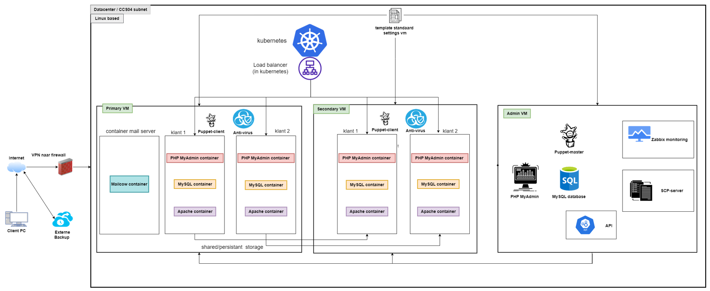

# Project Hosting

As a team of 6 dedicated students, we have taken on the challenge of developing our own hosting platform specifically tailored to run PHP projects for fellow programming students. Alongside this, we are also responsible for creating a robust API to efficiently control and manage the platform. Currently, we are fully immersed in the development process, working diligently to bring our vision to life.

**Completed:** June 2023

## Project Hosting

Our project hosting platform has been meticulously planned, and we have created a comprehensive schema that outlines its structure and functionality. At the core of our platform is the Admin VM, which serves as the control center for various essential services. One of these critical services is Zabbix, our chosen monitoring software, which ensures the seamless performance and reliability of our platform.

To facilitate secure file uploads, we have implemented an SCP server on the Admin VM. This allows users to conveniently and securely transfer their project files to our platform, ensuring the integrity and confidentiality of their data. In addition, the Master VM hosts our API, which serves as a centralized interface for seamless management and control of our hosting platform. Through the API, users can effortlessly interact with various features and functionalities, allowing them to efficiently manage their projects and make the most of our hosting services.

To manage user data efficiently, we have integrated a MySQL database into the Master VM. This database stores vital information about our users, ensuring smooth user management and seamless project deployment. To enhance the database management experience, we have incorporated PHP MyAdmin, providing a user-friendly dashboard for efficient administration.

Furthermore, our Admin VM takes on the role of the Puppet master, enabling us to set up and control all other virtual machines within our infrastructure. Additionally, we have set up two additional VMs dedicated to our customers. These VMs act as puppet clients and are configured with two Kubernetes nodes each, forming a cluster environment. This cluster setup allows us to run our services in separate containers, ensuring scalability, isolation, and efficient resource utilization.

For our customers, we have gone the extra mile to provide a comprehensive containerized environment. Each customer VM hosts separate containers for PHP, MySQL, and Apache web servers, ensuring a streamlined and reliable hosting experience for their PHP projects. Additionally, we have dedicated a separate node to run a Mailcow container, allowing all our customers to utilize automatic email functionality, as per their requirements.

Our project hosting endeavour is driven by the commitment to provide a reliable, secure, and user-friendly platform for fellow students to host their PHP projects. We are enthusiastic about the progress we have made thus far and continue to work tirelessly to bring our vision to fruition, empowering students to showcase their technical skills and achieve their project goals seamlessly.

Our ongoing Project Hosting initiative is dedicated to developing a robust and user-friendly platform for students to host their PHP projects. With a cohesive team, we have made significant progress in creating a comprehensive hosting solution and efficient API. Our platform incorporates essential services such as Zabbix for monitoring and an SCP server for secure file uploads. The Master VM successfully hosts the API, ensuring seamless project management. We have seamlessly integrated MySQL and PHP MyAdmin for efficient user data handling. Our infrastructure, led by the Admin VM as the Puppet master, provides scalability for future growth. Customer VMs offer containerized environments featuring PHP, MySQL, and Apache web servers, ensuring a streamlined hosting experience. The Mailcow container enables automatic email functionality for all our users. Our Project Hosting initiative is driven by our commitment to empowering students to showcase their skills and achieve their project goals effortlessly. As we continue our development efforts, we remain dedicated to delivering a reliable, secure, and user-friendly hosting platform that contributes to the success of the programming community.

